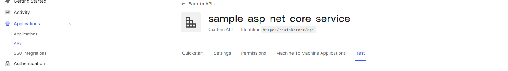
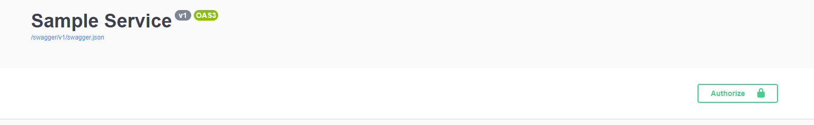
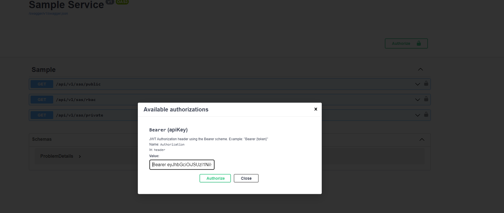
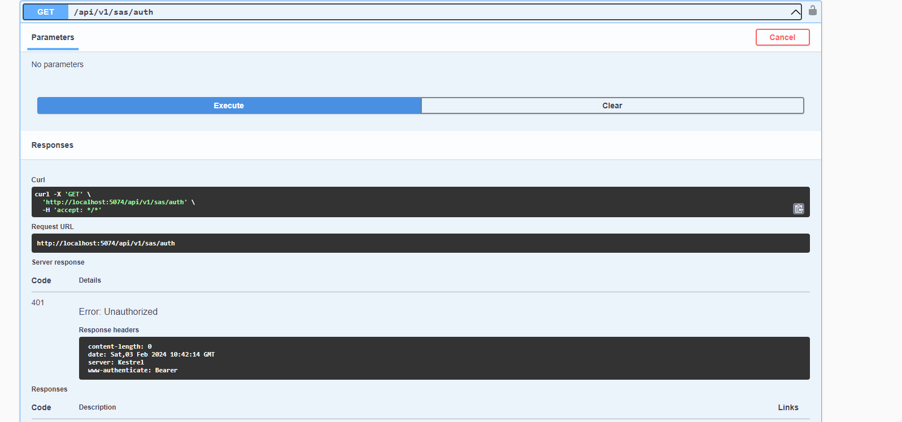
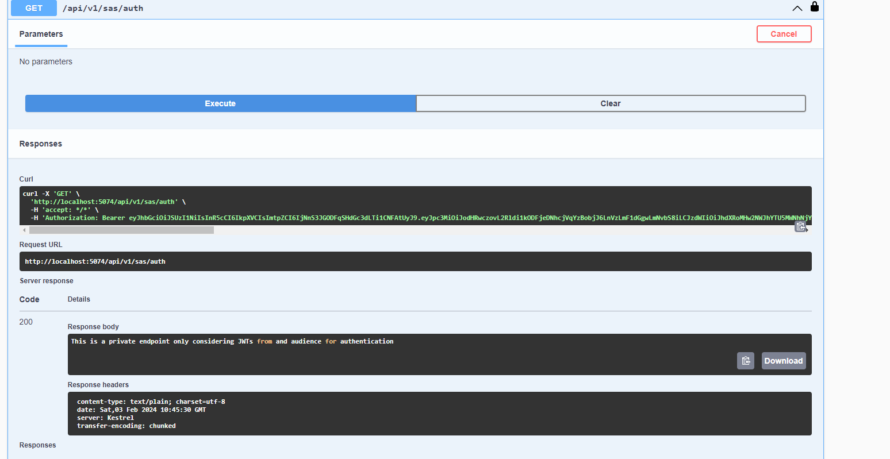
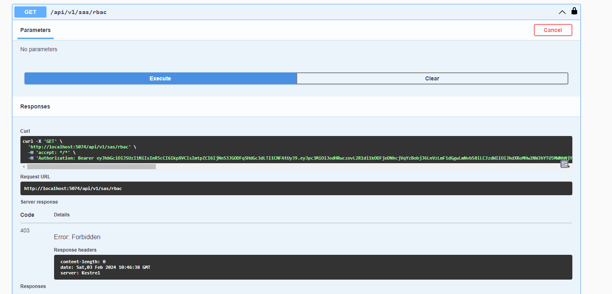
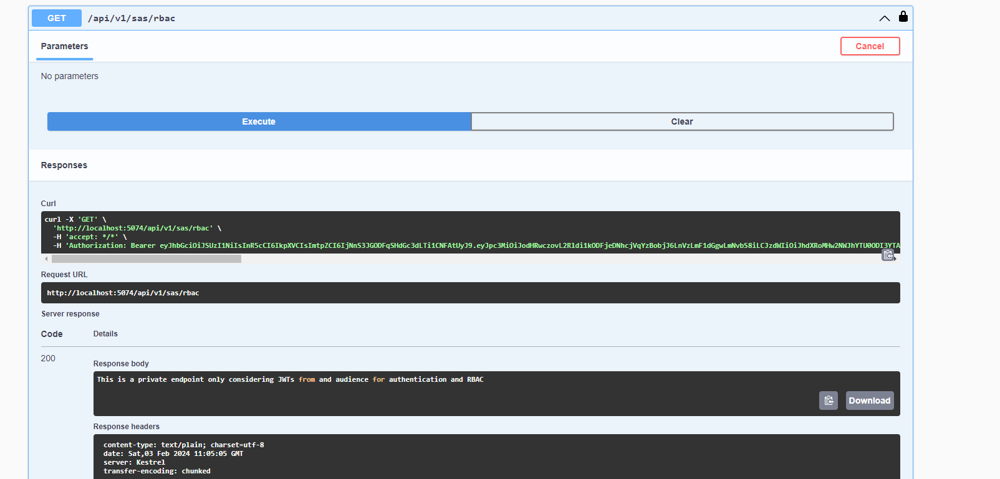

# SampleService - C# ASP .NET Core backend service utilizing Microsoft JwtBearer nuget packages

## Prerequisite

- [Install latest dotnet SDK](https://dotnet.microsoft.com/en-us/download) for your target platform
- [Install docker engine](https://docs.docker.com/engine/install/) for your target platform

## Run backend service with dotnet cli tool

```sh
dotnet run
```

Explore the Swagger Web UI in a browser of your preference by entering: `http://localhost:5074/swagger`

## Run backend service with docker

```sh
# Building the docker image
docker build -t csharp-service-considering-auth0:0.1.0 .
# Run the docker container
docker run --rm -e "Auth0__Domain=dev-d81cx3ar5jc0hn2z" -e "Auth0__Audience=https://quickstart/api" -p 5001:8080 -d csharp-service-considering-auth0:0.1.0 
```

Explore the Swagger Web UI in a browser of your preference by entering: `http://localhost:5001/swagger`

## Retrieve a bearer token (This only considers authentication and not RBAC)

Go to your configured API in the Auth0 portal and select the `Test` button. 



Following curl request should return a JSON response body containing a bearer token:

```sh
curl --request POST \
  --url https://<your Auth0 tenant domain>.us.auth0.com/oauth/token \
  --header 'content-type: application/json' \
  --data '{"client_id":"<your Auth0 application client id>","client_secret":"<your Auth0 application client secret>","audience":"<your Auth0 applicatio audience, e.g. https://quickstart/api>","grant_type":"client_credentials"}'
```

## Test endpoints trough Swagger UI considering RBAC

Click the `Authorize button` displayed in the Swagger UI depicted in the following image: 



Set the Bearer token retrieved from the **locally running Angular application** ([Checkout README.md](../../../../spas/angular/sample-app/README.md). Essentialy `cd ../../../../spas/angular/sample-app && ng run && cd -`) in Swagger UI:



### Typical HTTP responses

No bearer token from audience **https://quickstart/api** provided on `api/v1/sas/auth` endpoint returns a status code of **401 - Unauthorized**:



Valid bearer token from audience **https://quickstart/api** provided on `api/v1/sas/auth` endpoint returns a status code of **200 - OK**:



Valid bearer token from audience **https://quickstart/api without correct user role permissions** provided on `api/v1/sas/rbac` endpoint returns a status code of **403 - Forbidden**:



Valid bearer token from audience **https://quickstart/api with correct user role permissions** provided on `api/v1/sas/rbac` endpoint returns a status code of **200 - OK**:

