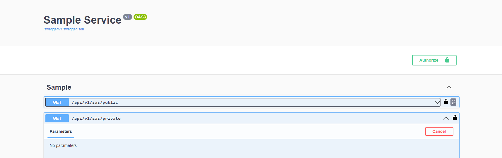

# SampleService

## Prerequisite

[Install latest dotnet SDK](https://dotnet.microsoft.com/en-us/download) for your target platform and CPU arch.

## Run bacend service with dotnet

```sh
dotnet run
```

## Retrieve a bearer token

Go to your configured API in the Auth0 portal and select the `Test` button. 


Following curl request should return a JSON response body containing a bearer token:

```sh
curl --request POST \
  --url https://<your Auth0 tenant domain>.us.auth0.com/oauth/token \
  --header 'content-type: application/json' \
  --data '{"client_id":"<your Auth0 application client id>","client_secret":"<your Auth0 application client secret>","audience":"<your Auth0 applicatio audience, e.g. https://quickstart/api>","grant_type":"client_credentials"}'
```

## Test endpoints trough Swagger UI

Click the `Authorize button` displayed in the Swagger UI depicted in the following image and set the Bearer token:


Test HTTP endpoints:

