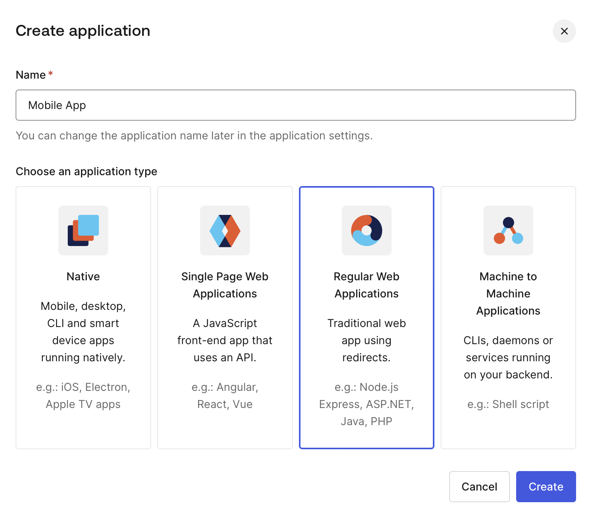
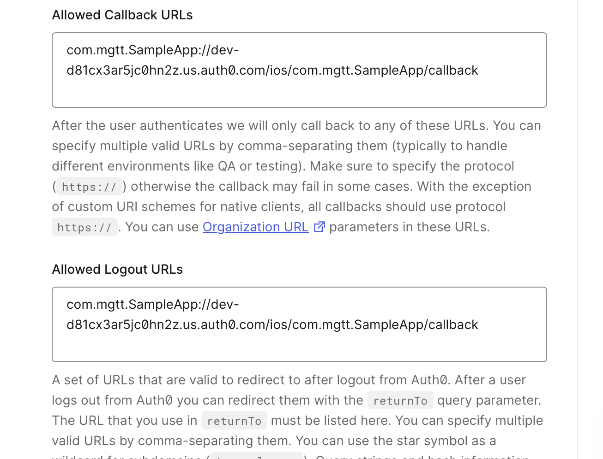
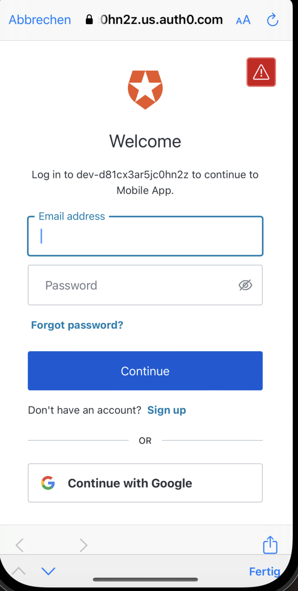

# Swift SampleApp - OIDC flow in Mobile apps utilizing Auth0 swift package

## References

- [iOS/macOS Quickstart](https://auth0.com/docs/quickstart/native/ios-swift/01-login#configure-a-custom-url-scheme)

## Prerequisite

### Installation

- A MacBook or iMac equipped with Xcode, enabling the simulation of iOS 16.4 devices

### Auth0 objects setup

0. Create in Auth0 a **`Native`** application

1. Configure URIs

Steps 2 to 6 are documented in [the Angular SPA README.md](../../../spas/angular/sample-app/README.md)

### Run the mobile application

Open the Swift project in XCode via `open sample-app.xcodeproj`.
Run the application with `command+R` key shortcut.

Results when clicking on the login button should look similair to:

