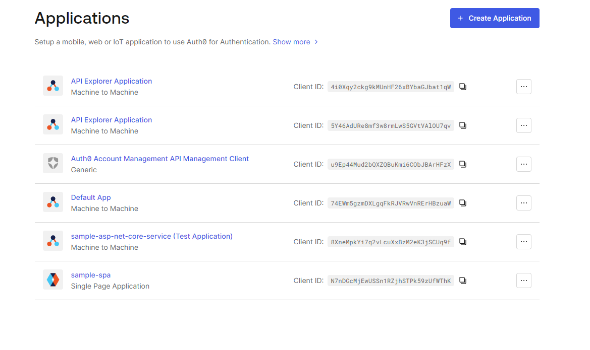
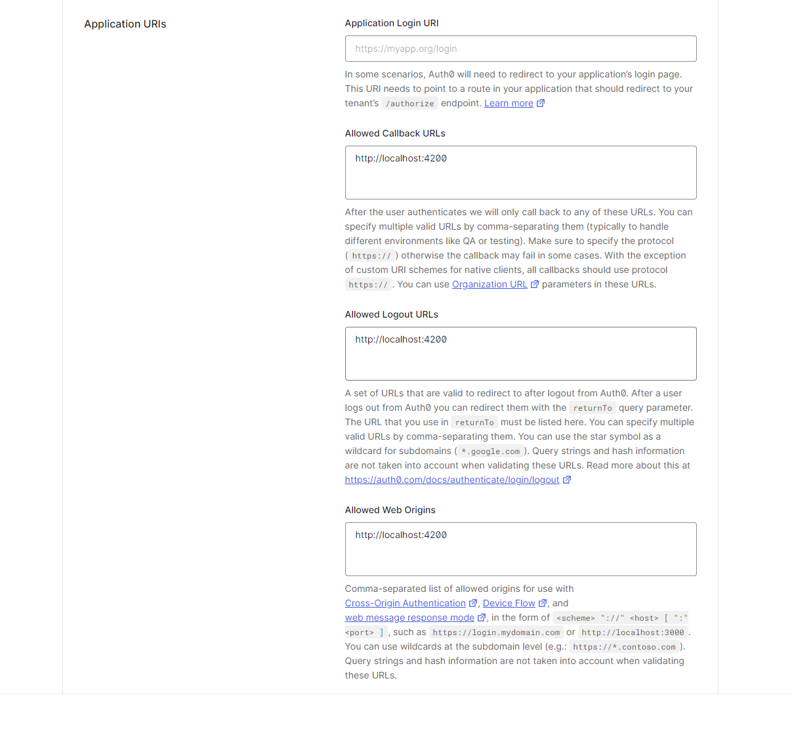
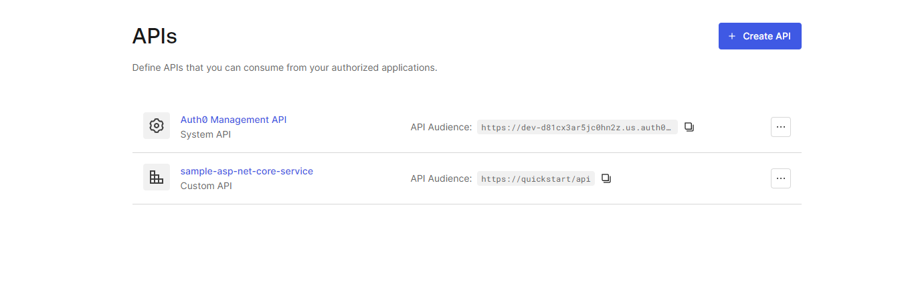
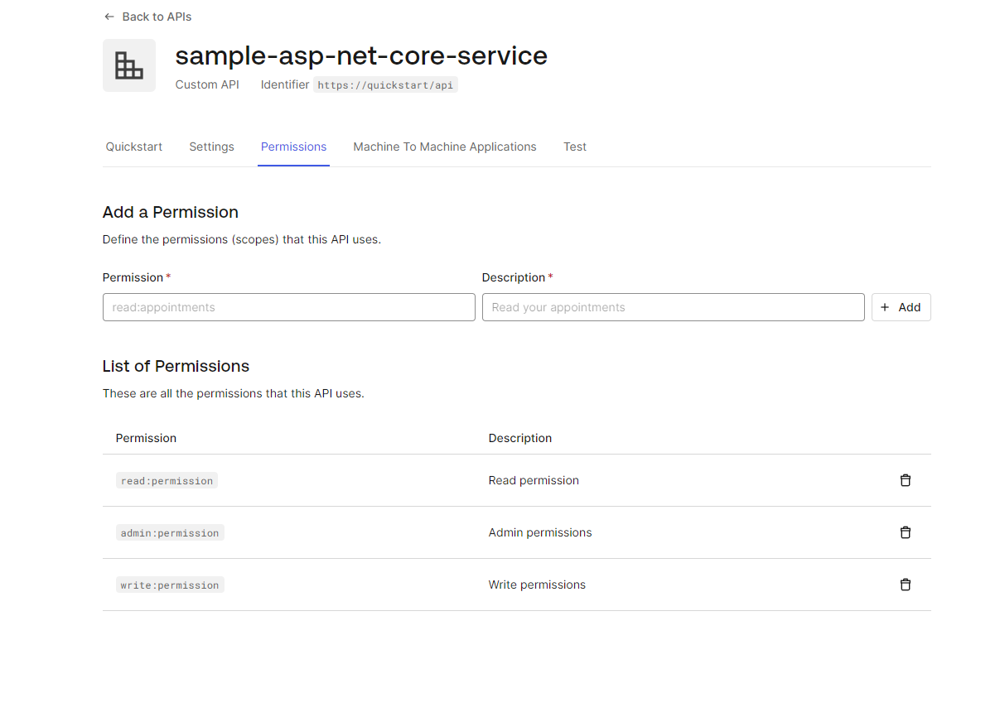
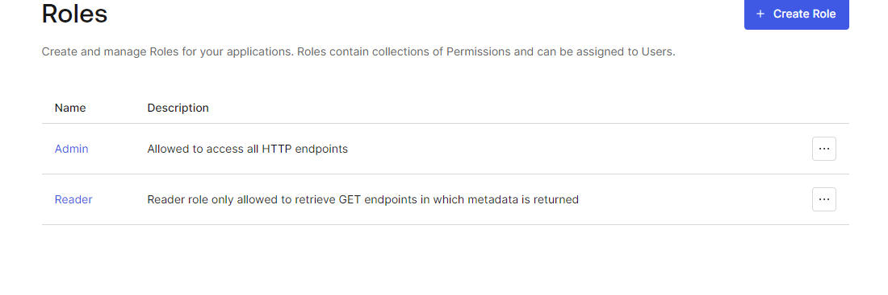
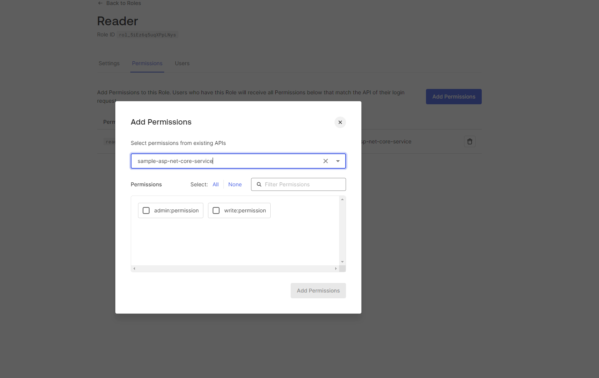

# SampleApp

This project was generated with [Angular CLI](https://github.com/angular/angular-cli) version 17.1.2.

## Prerequisite

### Installation

- Install node.js via [package manager](https://nodejs.org/en/download/package-manager) or [download and run installer executables](https://nodejs.org/en) for your target platform
- Install Angular cli: `npm install -g @angular/cli`

### Auth0 objects setup

0. Create in Auth0 an SPA, e.g. `sample-app`

1. Configure URIs

2. Create in Auth0 an API, e.g. `sample-asp-net-core-service`

3. Set permissions for API

4. Create roles in `User Managemenet` view

5. Assign permissions for API to roles 

## Development server

Run `ng serve` for a dev server. Navigate to `http://localhost:4200/`. The application will automatically reload if you change any of the source files.

## Code scaffolding

Run `ng generate component component-name` to generate a new component. You can also use `ng generate directive|pipe|service|class|guard|interface|enum|module`.

## Build

Run `ng build` to build the project. The build artifacts will be stored in the `dist/` directory.

## Running unit tests

Run `ng test` to execute the unit tests via [Karma](https://karma-runner.github.io).

## Running end-to-end tests

Run `ng e2e` to execute the end-to-end tests via a platform of your choice. To use this command, you need to first add a package that implements end-to-end testing capabilities.

## Further help

To get more help on the Angular CLI use `ng help` or go check out the [Angular CLI Overview and Command Reference](https://angular.io/cli) page.